# appchemy_trainer
The code for training the [Variational Autoencoder and Encoding the Database of Images on this paper Exploiting Latent Codes: Interactive Fashion Product Generation, Similar Image Retrieval, and Cross-Category Recommendation using Variational Autoencoders](https://www.researchgate.net/publication/344067072_Exploiting_Latent_Codes_Interactive_Fashion_Product_Generation_Similar_Image_Retrieval_and_Cross-Category_Recommendation_using_Variational_Autoencoders).  

And supplementary code to the [Appchemy webapp](https://github.com/sarmientoj24/Apparelchemy)

**Note:** The code was created back in 2019. Code may not work now because of versioning.

# Abstract
The author proposes using Variational Autoencoders (VAE) where the author exploits its capability to regularisethe latent space for generating new samples from the distribution and to generate a latent representation of data as features and introduces two methods in utilizing the latent variables
for similar image retrieval, recommendation. This enables a base framework that can be used for the e-commerce industry that implements collaborative design for product styles, product clustering, image retrieval and recommender systems using only one architecture to solve multiple problems.

# Use Case Diagram
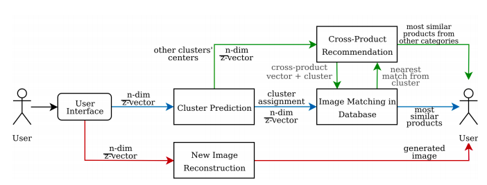

# Tools/Frameworks/Languages used
Training and Inference
- Python 3.x
- Keras
- OpenCV
- numpy, pandas, pyplot

Image Encoding, Integration to database, image retrieval, clustering
- sqlite
- sklearn
- OpenCV

# Data Source/Engineering
All data are scraped from Zappos using a webscraper. The webscraping tool, however, isn't included in this repository.
They were manually checked to remove wrong items and those which has a none white background. All images are of size 240x183 with three channels.

# Model Architecture and Training
Since the project is focused more on the image retrieval aspect then the generative capability of VAE, the network is small. The model is trained in Google Colab that uses K80 Tesla as GPU and includes 25GB of RAM for 200 epochs which took approximately four hours. The model architecture is composed of three Convolution layers and Dense layers for the encoder and three Deconvolution layers and Dense layers for the decoder and is built in Keras. The bottleneck layer is size 16.

### Encoder
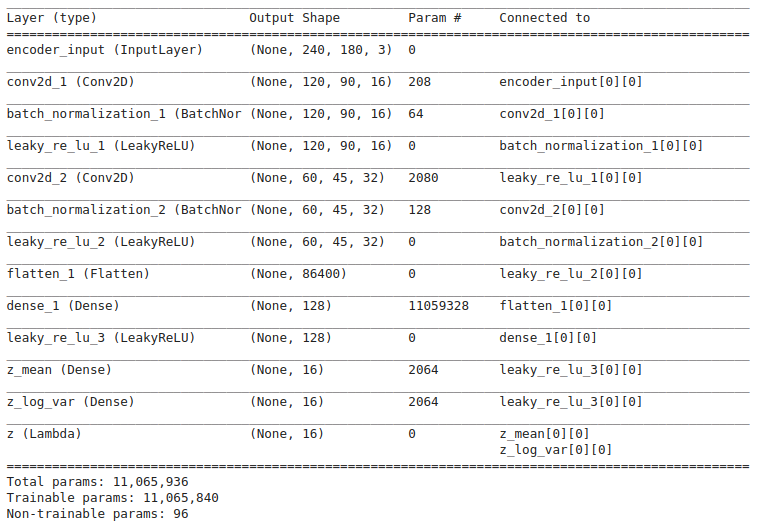

### Decoder
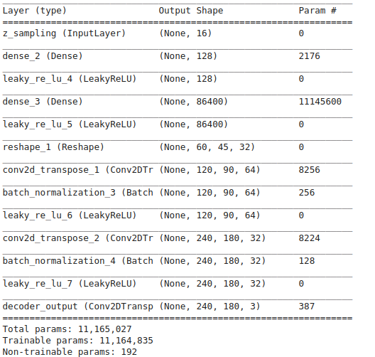

### VAE
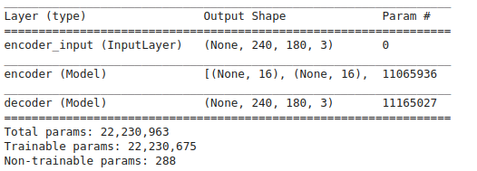

# Quality of output of the VAE reconstruction
All outputs are reconstructed using a size 16 vector/latent vector.

**Original**  
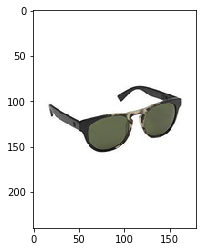

**Reconstructed**  
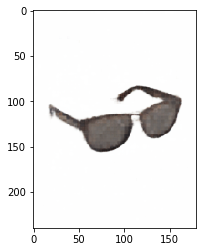

# Interacting with the webapp
You are given 16 (latest vector size/bottleneck) sliders to change the appearances of the apparel into something you'd like. Upon changing the sliders, an attribute of the image changes as seen below.  
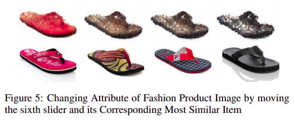

# Similar Image Retrieval
After the user interacts with the slider and synthesizes the image, its z¯-vector is used to find similar images from the database. For this purpose, the author proposes two methods that tries to solve the problem in different manners. The first one takes advantage of the objective function being optimized by VAEs while the second one exploits the sampling process from reparameterization trick used to derive zx from µx and σx. In order to use these techniques for image retrieval, encodings of each images are generated using the trained encoder and stored in a database. The encoding for an image is composed of n-dimensional µx-vector and σx-vector and an ndimensional vector computed from a fixed epsilon sampling that will be discussed in the next sections.

## Log-Likelihood Maximization in Image Retrieval
On training, the encoder is essentially parameterizing the variational posterior distribtion of z given x, (see Equation below). Think of the problem as if the x are parameters of the probability distribution while z are some observations you made. This implies that the nearest encoding from the training data x would be the encoding with the highest likelihood evaluated by the equation taking the x with the maximal value. The loglikelihood provides something similar to a negative euclidean distance between µ(x) and z, but scales and shifts by terms determined by the standard deviation.  
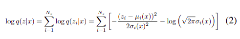

Code for this is the following
```
def compute_log_likelihood(z_gen, mu_, log_sigma):
  # (zi−μi(x))22σi(x)2
  term_a = (z_gen - mu_) ** 2
  term_b = 2 * (log_sigma ** 2)
  term_c = -1 * (term_a / term_b)

  # −log(2π−−√σi(x))
  term_d = np.log(((2 * np.pi) ** 0.5) * (log_sigma))
  term_e = term_c - term_d

  likelihood = np.sum(term_e)
  return likelihood
```

## Fixed Epsilon Sampling Encoding Trick in Image Retrieval
The trick is to use a fixed, n-sized epsilon vector randomly sampled once from a Gaussian distribution for each encoding process of the images. In other words, instead of randomly sampling epsilon for every encoding process, the epsilon is held constant and z is calculated using the same Equation 1. This method allows us to directly measure the distance between z¯-vector and each encoded z-vector in the database using any traditional distance metric such as Euclidean distance, Manhattan Distance, etc.

The most similar images are retrieved using log-likelihood maximization and Euclidean distance on fixed-epsilon sampling encoding as discussed earlier. **But before retrieving. similar images to the one generated by the user, its cluster is predicted first using Euclidean distance between z¯-vector and the cluster centers. The application retrieves similar images from the cluster it was assigned.**

# Clustering the Images
Each image from the training dataset is encoded using the encoder of the trained model and stored in the database. Both the µx and σx vectors and fixed zx vectors are part of the encodings upon finishing training the model. These encodings will be used for retrieving similar images, clustering and recommendations.

K-means clustering with k = 3 is used to cluster the entries in the database using both µx vector and fixed zx vector. Each entry has a subcategory tag (e.g. footwear, eyewear, or bag) and will be used for evaluating both clustering and similar image retrieval. All fashion products in the database are included in this clustering procedure.

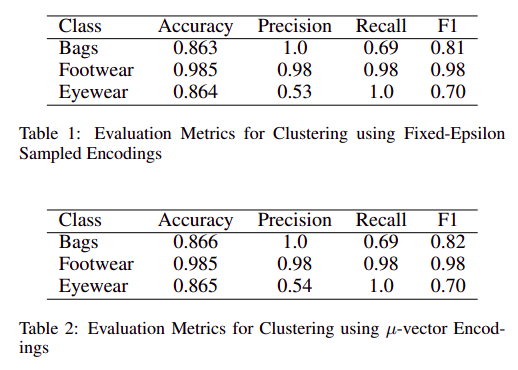

# Recommendation Outputs
**Retrieved Most Similar using Log-Likelihood**  
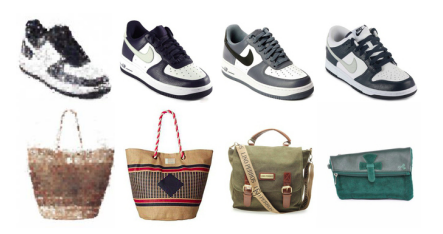

**Retrieved Most Similar Fixed-Epsilon Sampling**  
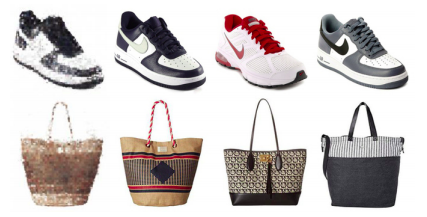

# Cross-Category Recommendation
Aside from providing the most similar images to the user, latent codes can also be employed in recommending products from other clusters or categories. This also takes full advantage of the nature of the latent space VAEs generate which enables smooth interpolation and smooth mix of features a decoder can understand. Simple vector arithmetic in the latent space can be utilized to navigate through the smooth interpolation of the latent space. For example, to generate specific features such as generating glasses on faces, we find two samples, one with glasses and one without and obtain the difference of their encoded vectors from the encoded. We add the difference as ”glasses” vector to the encodings of any other image that has no glasses.

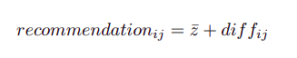  
Here, the clusters or categories are defined by the cluster centers. Take the difference of each center vectors (e.g. centeri - centerj ) as diffij from one another where i is the cluster assignment of z¯-vector and j is a cluster not equal to i. In order to recommend products from other clusters, add each difference vector diffij to z¯-vector as seen in Equation 3. This does not recommend a reconstructed image using the decoder with recommendationij . It does, however, recommend a retrieved image from the database with the nearest to the calculated vector from the jth cluster using the presented image retrieval techniques.

## Cross-Category Recommendation Using Log-Likelihood Maximization
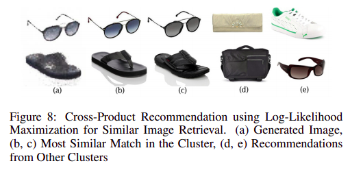

##  Cross-Category Recommendation Using using Euclidean Distance on Fixed-Epsilon Sampling Encodings
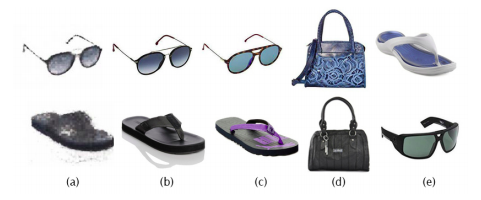
